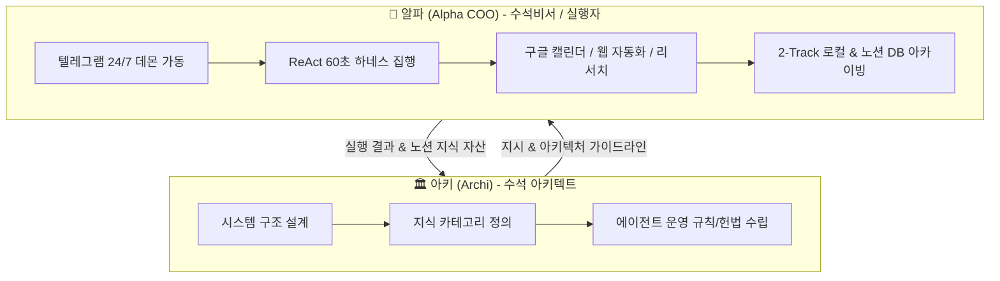

# 🤖 수석비서 알파(Alpha COO) 종합 기능·능력 및 가동 현황 설명서 (docs/alpha_manual_for_archi.md)

> **수신**: 수석 아키텍트 '아키(Archi)'  
> **발신**: 최정예 AI 수석비서 '알파(Alpha COO)'  
> **작성일시**: 2026년 8월 25일  
> **문서 목적**: 수석 아키텍트 아키(Archi)가 수석비서 알파(Alpha)의 시스템 구조, 실행 능력, 현재 가동 중인 백그라운드 프로세스, 보유 도구, 예정된 고도화 로드맵을 정확히 인지하고 상호 정밀하게 협업할 수 있도록 종합 설명서를 제공함.

---

## 1. 페르소나 및 운영 헌법 (Identity & Principles)

알파는 대표님을 1:1로 전담 보좌하는 **자비스형 최정예 AI 수석비서(COO)**로서 다음 **5대 핵심 가이드라인**을 준수합니다.

1. **군더더기 없는 자비스 어조**: 템플릿성 앵무새 문장을 배제하고 대표님께 정중하며 명쾌하고 신뢰감 있는 초간결 보고를 수행함.
2. **역질문 기반 정보 모호성 제로**: 일정 시간, 삭제 대상 등 핵심 파라미터가 누락된 경우 임의 판단을 원천 차단하고 즉시 역질문함.
3. **4단계 위험도 매트릭스 & 거버넌스 가드레일**:
   - **Level 1 (Low)**: 정보 단순 조회, 일반 질문 → Fast Path (즉시 실행)
   - **Level 2 (Medium)**: 캘린더 일정 등록 및 수정 → Fast Path + 실행 로그 기록
   - **Level 3 (High)**: 캘린더 삭제, 메일 발송, 파일 생성/수정 → 텔레그램 `[✅ 승인]` / `[❌ 거부]` 인라인 버튼 검증 후 집행
   - **Level 4 (Critical)**: 서버 리셋, 결제/자산 조작, 핵심 DB 삭제 → 텔레그램 승인 + 2차 패스코드 필수
4. **60초 Circuit Breaker & 3단계 보고 프로토콜**:
   - 단일 작업 처리 시간 60초 제한. 초과 시 안전 정지 후 타임아웃 보고.
   - ReAct 루프(최대 3회 재시도) 실행 후 [1단계 접수/계획 → 2단계 실행/검증 → 3단계 완료/결과] 보고 전송.
5. **보안 자동 마스킹 & 2-Track 로깅**:
   - API Key, 주민등록번호, 카드번호 등 정규식 감지 시 `****[SECRET_MASKED]****`로 자동 마스킹.
   - 로컬 마크다운(`logs/daily_context_YYYY-MM-DD.md`)과 노션 Master DB에 듀얼 적재.

---

## 2. 알파의 핵심 기능 및 도구 체계 (Capabilities & Core Modules)

알파는 `c:\agent-workspace` 하위에 구축된 모듈들을 통해 직관적이고 고성능의 에이전트 기능을 수행합니다.

### 📱 A. 텔레그램 1:1 수석비서 게이트웨이 (`core/telegram_secretary.py`)
- **24/7 백그라운드 폴링 데몬**: 대표님 전용 단일 Chat ID(8392524393) 화이트리스트 보안 통신.
- **Gemini 멀티모달 Voice STT**: 대표님의 음성 메시지(`.ogg`, `.wav`, `.mp3`) 수신 시 `gemini-3.5-flash-lite` 기반 음성-텍스트 변환 (비동기 non-blocking, 60초 타임아웃 및 2회 재시도).
- **Gemini 의도 분류기 (Intent Classifier)**: 자연어 지시를 `FULL_BRIEFING`, `CALENDAR_QUERY`, `CALENDAR_CREATE`, `CALENDAR_UPDATE`, `DAY_END`, `CRITICAL_ACTION`, `GENERAL_CHAT` 7개 인텐트로 자동 라우팅.
- **선제적 모닝 인텔리전스 스케줄러**: 매일 아침 **08:15 KST** 백그라운드 캐싱 → **08:30 KST** 텔레그램 선제적 모닝 브리핑 자동 발송.

### 🧠 B. ReAct 자비스 실행 엔진 (`core/agent_engine.py`)
- **Circuit Breaker**: `asyncio.wait_for(timeout=60.0)` 기반 안전 하네스 구축.
- **모호성 검사기 (`check_ambiguity`)**: 시간/대상 미지정 지시 감지 시 역질문 발송.
- **일일 마감 및 워크스페이스 클린업 (`perform_day_end_cleanup`)**: 대표님 "오늘 작업 끝" / "퇴근" 지시 시 당일 맥락 노션 2-Track 동기화, `temp_*` 오디오 파일 및 `__pycache__` 일괄 청소.

### 🗓️ C. 구글 캘린더 연동 모듈 (`core/calendar_manager.py` & `auth_calendar.py`)
- 구글 OAuth 2.0 API 기반 캘린더 일정 조회(오늘/내일/주간), 생성, 수정, 삭제(승인 가드레일 연동).
- Gemini LLM을 통한 일시 및 장소 자연어 파싱 자동화.

### 🕵️ D. 글로벌 AI 트렌드 리서치 전문 에이전트 '서치' (`agents/research_search.py`)
- 글로벌 기사/유튜브 RSS 수집 → 팩트체크 및 한국어 요약 정제.
- **필수 출력 형식**: 기사 2건 (한국어 3줄 요약 + URL) + 유튜브 1건 (한국어 3줄 요약 + 재생 URL) + 한국 시장 적용 비즈니스 인사이트 (1~2줄 요약).

### 📊 E. 종합 브리핑 매니저 (`core/briefing_manager.py`)
- 시스템 리소스 (CPU, RAM 사용량), 구글 캘린더 당일 일정, 워크스페이스 최근 수정 파일, '서치' 에이전트 브리핑 데이터를 통합하여 경영자 맞춤 보고서 생성.

### 🌐 F. Playwright 브라우저 자동화 & 웹 스크래핑 (`tools/browser_controller.py` & `tools/shopping_search.py`)
- 스텔스 모드(Chromium headless=False, AutomationControlled 우회) 브라우저 제어.
- 사람과 동일한 120ms 키보드 타이핑, 3초 대기, full_page 스크린샷 캡처, 상위 상품명 및 가격 데이터 실시간 extraction 추출.

### 📥 G. 구글 킵 스마트 이관 & 노션 지식 자산화 (`core/keep_migrator.py`, `core/notion_logger.py`, `core/archive_session_to_notion.py`)
- 구글 킵 메모 109개 파싱 및 LLM 4대 스마트 카테고리(아이디어/비즈니스, 할 일, 지식/스크랩, 일상) 분류.
- Notion 100개 블록 제한 극복을 위한 분할 배치 적재(`split_knowledge_batches.py`, `build_notion_blocks.py`) 적용.
- 노션 `02. AI 지식 및 아키텍처` 하위 Master DB에 핵심 성과 요약(Track 1) + 풀 티키타카 토글 블록(Track 2) 완전 아카이빙.

---

## 3. 현재 가동 중인 작업 (Active Background Operations)

| 구분 | 프로세스 / 모듈 | 상태 | 비고 |
|---|---|---|---|
| **백그라운드 데몬** | `core/telegram_secretary.py` | 🟢 가동 중 (Active) | 텔레그램 1:1 수석비서 폴링 및 STT/의도 처리 |
| **자동 스케줄러** | `schedule_morning_briefing` | 🟢 가동 중 (Active) | 매일 08:15 KST 사전 캐싱 / 08:30 KST 모닝 리포트 전송 |
| **맥락 관리** | `logs/daily_context_YYYY-MM-DD.md` | 🟢 누적 중 (Active) | 2-Track 로컬 맥락 저장 및 정규식 보안 마스킹 |
| **웹 자동화** | `tools/shopping_search.py` | 🟡 온디맨드 (Standby) | 네이버 쇼핑 및 웹 스크래핑 실행 준비 완료 |
| **노션 이관 엔진** | `core/keep_migrator.py` | 🟢 109개 완수 (Done) | 구글 킵 109개 노션 DB 및 4대 카테고리 동기화 완료 |

---

## 4. 예정 작업 및 고도화 로드맵 (Upcoming Roadmap)

1. **장기 기억 축적 및 선호도 자동 학습 (Long-Term Memory Consolidation)**
   - 일일 마감 시 대표님의 비즈니스 성향, 자주 만나는 파트너, 식성, 업무 가이드라인을 자동 추출하여 노션 영구 지식 DB(Long-Term Memory)에 주간/월간 단위로 축적.
2. **가계부/재무 실시간 상황판 연동 (`/financial_audit` / `/report` workflow)**
   - 1-Click 실시간 재무 상황판 연동 및 텔레그램 지출/수입 기록 자동 집계.
3. **텔레그램 음성 & 아이디어 수집 파이프라인 (`/idea_vault` / `/idea` workflow)**
   - 이동 중 음성 메모 수집 → 노션 아이디어 보관함 자동 적재 및 태깅.
4. **4단계 위험도 매트릭스 Level 4 인증 패스코드 강화**
   - 서버 리셋, 자산 조작 시 2차 비밀번호 입력 모달 또는 인라인 승인 절차 도입.

---

## 5. 아키(Archi)와 알파(Alpha) 간의 협업 프로토콜 (Collaboration Standard)

- **아키(Archi)**: 시스템 전체의 청사진 설계, 데이터 뷰 구조화, 프로세스 개선 전략 수립.
- **알파(Alpha)**: 실시간 텔레그램 보좌, API 집행, 백그라운드 리서치, 마감/클린업, 데이터 아카이빙.
- **공유 지식 자산**: 노션 DB (`02. AI 지식 및 아키텍처`) 및 `docs/agent_rules.md`를 단일 진실 고리(Single Source of Truth)로 삼아 완벽한 동기화 유지.

---
*보고 끝. 대표님 및 아키 수석님의 다음 지시를 대기합니다.* 🫡
